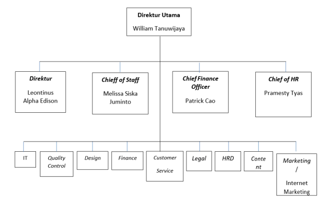
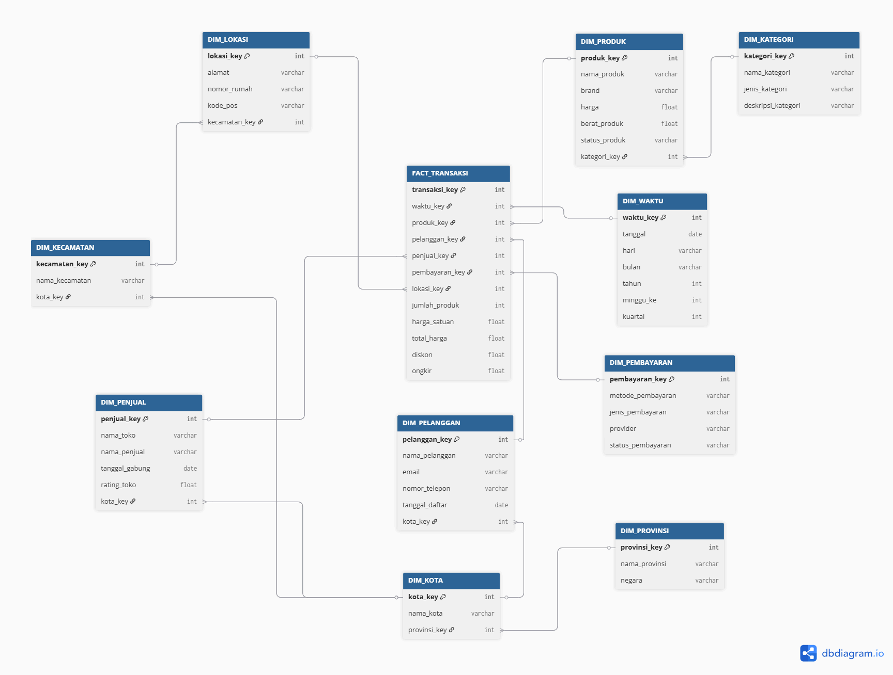
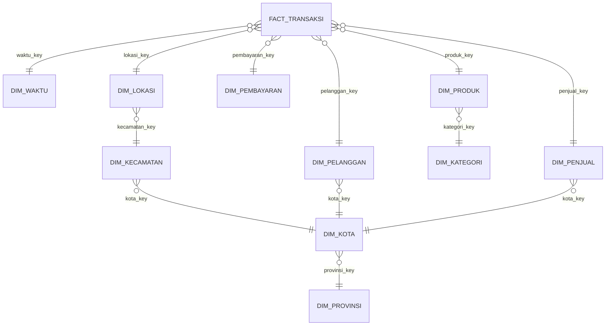

# Shopedia Commerce Warehouse Simulation

Repository ini berisi simulasi perancangan dan proses ETL **Data Warehouse** untuk **Shopedia**, sebuah perusahaan e-commerce fiktif. Dataset, nama perusahaan, pelanggan, penjual, produk, transaksi, dan seluruh nilai di dalamnya merupakan data dummy yang dibuat hanya untuk kebutuhan pembelajaran data warehouse.

Proyek ini dirancang untuk menunjukkan bagaimana data operasional e-commerce yang awalnya terpisah dalam beberapa file CSV dapat dimasukkan ke **Supabase**, dibersihkan, ditransformasikan, lalu dibentuk menjadi skema data warehouse untuk kebutuhan analisis transaksi, produk, pelanggan, penjual, pembayaran, dan wilayah.

> Catatan: Shopedia adalah nama simulasi. Dataset ini tidak menggunakan, tidak mewakili, dan tidak mengambil data dari perusahaan e-commerce nyata mana pun.

---

## 1. Gambaran Singkat Sistem

Shopedia digambarkan sebagai marketplace yang mempertemukan pelanggan dan penjual dalam proses jual beli produk secara online. Aktivitas operasional yang disimulasikan meliputi:

- pendaftaran pelanggan,
- pengelolaan toko atau merchant,
- pengelolaan katalog produk,
- pembuatan pesanan,
- detail item pesanan,
- pembayaran transaksi,
- penyimpanan alamat pelanggan,
- serta pengelompokan wilayah transaksi.

Data operasional tersebut pada awalnya masih berbentuk file CSV mentah. Oleh karena itu, file sumber tidak diberi nama seperti tabel data warehouse. Nama seperti `dim_pelanggan`, `dim_produk`, atau `fact_transaksi` hanya digunakan setelah data masuk ke layer akhir data warehouse.

---

### Struktur Organisasi Shopedia

Struktur organisasi berikut digunakan sebagai acuan pembagian bidang operasional pada dataset mentah.



Bidang seperti Customer Service, Content, Finance, Marketing / Internet Marketing, Quality Control, dan IT menjadi dasar untuk mengelompokkan sumber data operasional pada bagian dataset.

---

## 2. Lingkungan Implementasi

Proyek ini dibuat dengan menggunakan **Supabase** sebagai platform database. Supabase digunakan karena menyediakan database PostgreSQL yang dapat dipakai untuk membuat tabel, mengimpor CSV, menjalankan SQL, dan melakukan query analisis melalui SQL Editor.

Karena Supabase berjalan di atas PostgreSQL, pemisahan area kerja tidak dibuat menggunakan beberapa database terpisah. Pemisahan dilakukan menggunakan **schema PostgreSQL** seperti berikut:

| Schema | Fungsi |
|---|---|
| `raw` | Menyimpan data hasil impor CSV tanpa banyak perubahan |
| `staging` | Menyimpan data yang mulai distandarkan format dan tipe datanya |
| `warehouse` | Menyimpan tabel dimensi dan tabel fakta hasil ETL |

Contoh pembuatan schema di Supabase:

```sql
CREATE SCHEMA IF NOT EXISTS raw;
CREATE SCHEMA IF NOT EXISTS staging;
CREATE SCHEMA IF NOT EXISTS warehouse;
```

Dengan pendekatan ini, seluruh proses ETL tetap berada dalam satu project Supabase, tetapi setiap layer data tetap terpisah secara rapi.

---

## 3. Data Operasional Mentah

Dataset awal disusun menjadi beberapa CSV agar terlihat seperti hasil ekspor dari sistem operasional e-commerce, bukan seperti tabel data warehouse yang sudah jadi.

| No | File CSV | Bidang Operasional | Jumlah Baris | Isi Data |
|---:|---|---|---:|---|
| 1 | `customers.csv` | Customer Service | 921 | Data profil pelanggan, kontak, status, dan tanggal registrasi |
| 2 | `sellers.csv` | Marketing / Internet Marketing | 220 | Data toko, nama penjual, rating, level seller, dan status toko |
| 3 | `product_categories.csv` | Content | 35 | Referensi kategori produk |
| 4 | `products.csv` | Content / Design | 295 | Data produk, merek, kategori, harga, berat, dan status produk |
| 5 | `areas.csv` | IT | 100 | Data kecamatan, kota, provinsi, dan negara |
| 6 | `addresses.csv` | Customer Service | 858 | Data alamat yang terhubung ke pelanggan dan wilayah |
| 7 | `orders.csv` | Customer Service | 54.000 | Data header pesanan, tanggal transaksi, ongkir, dan total pembayaran |
| 8 | `order_items.csv` | Quality Control | 54.000 | Data detail produk dalam setiap pesanan |
| 9 | `payments.csv` | Finance | 54.000 | Data metode pembayaran, provider, status, dan nilai pembayaran |

---


## 4. Struktur Tabel di Supabase

### 4.1 Raw Schema

Tabel pada schema `raw` dibuat mengikuti struktur CSV apa adanya.

| Tabel Supabase | Sumber CSV |
|---|---|
| `raw.customers` | `customers.csv` |
| `raw.sellers` | `sellers.csv` |
| `raw.product_categories` | `product_categories.csv` |
| `raw.products` | `products.csv` |
| `raw.areas` | `areas.csv` |
| `raw.addresses` | `addresses.csv` |
| `raw.orders` | `orders.csv` |
| `raw.order_items` | `order_items.csv` |
| `raw.payments` | `payments.csv` |

Pada tahap ini, data masih dianggap sebagai data sumber. Kesalahan format, nilai kosong, variasi penulisan, atau nilai yang belum standar belum langsung dibuang, tetapi disiapkan untuk diproses pada tahap berikutnya.

### 4.2 Staging Schema

Schema `staging` digunakan untuk membuat versi data yang lebih bersih dan konsisten.

| Tabel | Fungsi |
|---|---|
| `staging.customers_clean` | Membersihkan data pelanggan |
| `staging.sellers_clean` | Membersihkan data penjual |
| `staging.product_categories_clean` | Membersihkan referensi kategori |
| `staging.products_clean` | Membersihkan data produk dan harga |
| `staging.areas_clean` | Menstandarkan data wilayah |
| `staging.addresses_clean` | Membersihkan alamat dan relasi wilayah |
| `staging.orders_clean` | Membersihkan data pesanan |
| `staging.order_items_clean` | Membersihkan detail item transaksi |
| `staging.payments_clean` | Membersihkan data pembayaran |

### 4.3 Warehouse Schema

Schema `warehouse` digunakan sebagai hasil akhir ETL. Pada layer ini data sudah dibentuk menjadi tabel dimensi dan fakta.

| Tabel | Jenis | Keterangan |
|---|---|---|
| `warehouse.dim_waktu` | Dimension | Dimensi waktu untuk analisis tanggal transaksi dan pembayaran |
| `warehouse.dim_pelanggan` | Dimension | Dimensi pelanggan |
| `warehouse.dim_penjual` | Dimension | Dimensi penjual atau merchant |
| `warehouse.dim_produk` | Dimension | Dimensi produk |
| `warehouse.dim_kategori` | Sub-dimension | Kategori produk |
| `warehouse.dim_pembayaran` | Dimension | Metode, jenis, provider, dan status pembayaran |
| `warehouse.dim_lokasi` | Dimension | Alamat transaksi |
| `warehouse.dim_kecamatan` | Sub-dimension | Kecamatan pelanggan, penjual, atau alamat transaksi |
| `warehouse.dim_kota` | Sub-dimension | Kota pelanggan, penjual, atau wilayah alamat |
| `warehouse.dim_provinsi` | Sub-dimension | Provinsi dan negara |
| `warehouse.fact_transaksi` | Fact | Fakta transaksi pada level item pesanan |

Grain utama dari `warehouse.fact_transaksi` adalah **satu baris untuk satu item dalam satu pesanan**. Dengan grain ini, analisis bisa dilakukan sampai level produk, kategori, penjual, pelanggan, pembayaran, dan wilayah.

---

## 5. Model Warehouse yang Digunakan

Model akhir menggunakan pendekatan **Snowflake Schema**. Beberapa dimensi dibuat lebih terstruktur dengan sub-dimensi, misalnya produk memiliki kategori produk, sedangkan alamat memiliki area/wilayah.





Dengan struktur tersebut, Shopedia dapat melakukan analisis seperti:

- tren penjualan per bulan,
- performa produk dan kategori,
- kontribusi penjualan dari setiap seller,
- persebaran pelanggan berdasarkan wilayah,
- total transaksi berdasarkan metode pembayaran,
- serta evaluasi nilai transaksi dan diskon.

---

## 6. Urutan Proses ETL di Supabase

Proses ETL yang disarankan:

```text
1. Upload CSV ke Supabase
2. Simpan data awal pada schema raw
3. Bersihkan dan standarkan data ke schema staging
4. Bentuk tabel dimensi pada schema warehouse
5. Bentuk tabel fakta pada schema warehouse
6. Jalankan query validasi dan query analisis
```

Urutan script SQL yang dapat dibuat:

```text
01_create_schema.sql
02_create_raw_tables.sql
03_import_raw_csv.sql
04_create_staging_tables.sql
05_transform_to_staging.sql
06_create_warehouse_tables.sql
07_load_dimensions.sql
08_load_fact_transaksi.sql
09_validation_queries.sql
10_analysis_queries.sql
```

Pada Supabase, CSV dapat diimpor melalui Table Editor atau melalui SQL sesuai kebutuhan project. Setelah data masuk ke tabel `raw`, script transformasi dapat dijalankan melalui SQL Editor.

---

## 7. Aturan Transformasi Data

### 7.1 Standardisasi Teks

Beberapa nilai teks perlu diseragamkan agar hasil analisis tidak terpecah karena perbedaan penulisan.

Contoh:

| Nilai Mentah | Nilai Setelah Transformasi |
|---|---|
| `aktif`, `ACTIVE`, `Active` | `Active` |
| `nonaktif`, `Inactive`, `Blocked` | `Inactive` |
| `Sukses`, `Berhasil`, `Success` | `Success` |
| `Gagal`, `Failed` | `Failed` |

### 7.2 Konversi Tanggal

Kolom tanggal seperti `registered_at`, `joined_at`, `order_date`, dan `paid_at` dikonversi ke tipe `date` atau `timestamp` PostgreSQL.

Contoh pendekatan di Supabase/PostgreSQL:

```sql
NULLIF(order_date, '')::timestamp
```

Jika format tanggal mentah tidak seragam, proses transformasi dapat memakai validasi tambahan sebelum melakukan casting.

### 7.3 Validasi Angka dan Nominal

Kolom numerik seperti harga, diskon, ongkir, dan total transaksi perlu dikonversi menjadi tipe `numeric`.

Kolom yang perlu divalidasi antara lain:

```text
base_price
unit_price
discount_amount
line_total
items_total
shipping_fee
grand_total
payment_amount
```

Nilai negatif pada harga, kuantitas, atau total transaksi tidak boleh langsung dimasukkan ke tabel fakta tanpa koreksi atau pengecualian pada tahap transformasi.

### 7.4 Perhitungan Ulang Total Transaksi

Total transaksi sebaiknya dihitung ulang dari data detail agar tidak bergantung sepenuhnya pada nilai raw.

Rumus yang digunakan:

```text
line_total = (quantity * unit_price) - discount_amount
grand_total = SUM(line_total per order) + shipping_fee
```

Hasil perhitungan ini digunakan untuk memastikan nilai pada `orders.csv`, `order_items.csv`, dan `payments.csv` tetap konsisten.

### 7.5 Penanganan Missing Value

| Kondisi | Penanganan |
|---|---|
| Email atau nomor telepon kosong | Diisi `Unknown` jika dibutuhkan untuk laporan |
| Provider pembayaran tidak relevan | Diisi `Not Applicable` |
| Tanggal pembayaran belum ada | Dibiarkan `NULL` jika transaksi belum dibayar |
| Relasi dimensi tidak ditemukan | Dipetakan ke row `Unknown` pada dimensi terkait |
| Nilai numerik tidak valid | Dikoreksi atau tidak dimuat ke tabel fakta |

---

## 8. Contoh Query Validasi

### 8.1 Mengecek Jumlah Data Fakta

```sql
SELECT COUNT(*) AS total_fact_rows
FROM warehouse.fact_transaksi;
```

### 8.2 Mengecek Nilai Penjualan

```sql
SELECT
    SUM(jumlah_produk) AS total_quantity,
    SUM(total_harga) AS total_sales,
    SUM(diskon) AS total_discount
FROM warehouse.fact_transaksi;
```

### 8.3 Mengecek Foreign Key Kosong

```sql
SELECT
    SUM(CASE WHEN waktu_key IS NULL THEN 1 ELSE 0 END) AS null_waktu_key,
    SUM(CASE WHEN pelanggan_key IS NULL THEN 1 ELSE 0 END) AS null_pelanggan_key,
    SUM(CASE WHEN penjual_key IS NULL THEN 1 ELSE 0 END) AS null_penjual_key,
    SUM(CASE WHEN produk_key IS NULL THEN 1 ELSE 0 END) AS null_produk_key,
    SUM(CASE WHEN pembayaran_key IS NULL THEN 1 ELSE 0 END) AS null_pembayaran_key,
    SUM(CASE WHEN lokasi_key IS NULL THEN 1 ELSE 0 END) AS null_lokasi_key
FROM warehouse.fact_transaksi;
```

### 8.4 Mengecek Nominal Tidak Valid

```sql
SELECT
    SUM(CASE WHEN jumlah_produk <= 0 THEN 1 ELSE 0 END) AS invalid_quantity,
    SUM(CASE WHEN harga_satuan < 0 THEN 1 ELSE 0 END) AS negative_unit_price,
    SUM(CASE WHEN total_harga < 0 THEN 1 ELSE 0 END) AS negative_line_total
FROM warehouse.fact_transaksi;
```

---

## 9. Contoh Query Analisis

### 9.1 Penjualan Berdasarkan Kategori Produk

```sql
SELECT
    k.nama_kategori,
    COUNT(*) AS total_transaction_items,
    SUM(f.jumlah_produk) AS total_quantity,
    SUM(f.total_harga) AS total_sales
FROM warehouse.fact_transaksi f
LEFT JOIN warehouse.dim_produk p
    ON f.produk_key = p.produk_key
LEFT JOIN warehouse.dim_kategori k
    ON p.kategori_key = k.kategori_key
GROUP BY k.nama_kategori
ORDER BY total_sales DESC;
```

### 9.2 Tren Penjualan Bulanan

```sql
SELECT
    w.tahun,
    w.bulan,
    COUNT(*) AS total_transaction_items,
    SUM(f.total_harga) AS total_sales
FROM warehouse.fact_transaksi f
LEFT JOIN warehouse.dim_waktu w
    ON f.waktu_key = w.waktu_key
GROUP BY w.tahun, w.bulan
ORDER BY w.tahun, w.bulan;
```

### 9.3 Performa Metode Pembayaran

```sql
SELECT
    p.metode_pembayaran,
    p.provider,
    COUNT(*) AS total_payments,
    SUM(f.total_harga) AS total_sales
FROM warehouse.fact_transaksi f
LEFT JOIN warehouse.dim_pembayaran p
    ON f.pembayaran_key = p.pembayaran_key
GROUP BY p.metode_pembayaran, p.provider
ORDER BY total_sales DESC;
```

### 9.4 Performa Seller

```sql
SELECT
    s.nama_toko,
    COUNT(*) AS total_transaction_items,
    SUM(f.jumlah_produk) AS total_quantity,
    SUM(f.total_harga) AS total_sales
FROM warehouse.fact_transaksi f
LEFT JOIN warehouse.dim_penjual s
    ON f.penjual_key = s.penjual_key
GROUP BY s.nama_toko
ORDER BY total_sales DESC;
```

---

## 10. Struktur Folder Project

Struktur folder yang disarankan:

```text
Shopedia-Warehouse-Supabase/
|-- Data/
|   |-- customers.csv
|   |-- sellers.csv
|   |-- product_categories.csv
|   |-- products.csv
|   |-- areas.csv
|   |-- addresses.csv
|   |-- orders.csv
|   |-- order_items.csv
|   `-- payments.csv
|-- Image/
|   |-- StrukturOrganisasi.png
|   `-- TabelERD.png
|-- sql/
|   |-- 01_create_schema.sql
|   |-- 02_create_raw_tables.sql
|   |-- 03_import_raw_csv.sql
|   |-- 04_create_staging_tables.sql
|   |-- 05_transform_to_staging.sql
|   |-- 06_create_warehouse_tables.sql
|   |-- 07_load_dimensions.sql
|   |-- 08_load_fact_transaksi.sql
|   |-- 09_validation_queries.sql
|   `-- 10_analysis_queries.sql
`-- README.md
```

---

## 11. Catatan Penggunaan di Supabase

Langkah umum penggunaan:

1. Buat project baru di Supabase.
2. Jalankan script `01_create_schema.sql` untuk membuat schema `raw`, `staging`, dan `warehouse`.
3. Buat tabel raw sesuai struktur CSV.
4. Impor masing-masing CSV ke tabel pada schema `raw`.
5. Jalankan script transformasi untuk mengisi schema `staging`.
6. Jalankan script pembuatan tabel warehouse.
7. Load data dimensi terlebih dahulu.
8. Load `warehouse.fact_transaksi` setelah seluruh dimensi tersedia.
9. Jalankan query validasi.
10. Gunakan query analisis untuk kebutuhan laporan.

Hal penting yang perlu diperhatikan:

- Supabase menggunakan PostgreSQL, sehingga sintaks SQL disesuaikan dengan PostgreSQL.
- Tidak perlu membuat database baru seperti `Shopedia_Staging` dan `Shopedia_DW`; cukup gunakan schema.
- Nama tabel raw tetap dibuat menyerupai nama file operasional.
- Nama tabel dimensi dan fakta hanya digunakan pada schema `warehouse`.
- Semua data dalam project ini adalah data dummy.

---

## 12. Ringkasan Akhir

Project ini mensimulasikan proses pembangunan data warehouse e-commerce untuk Shopedia menggunakan Supabase. Data awal disusun sebagai CSV operasional mentah, kemudian diproses melalui layer `raw`, `staging`, dan `warehouse`.

Hasil akhir dari proses ETL adalah Snowflake Schema yang dapat digunakan untuk analisis transaksi, performa produk, performa seller, perilaku pelanggan, metode pembayaran, dan persebaran wilayah penjualan.

