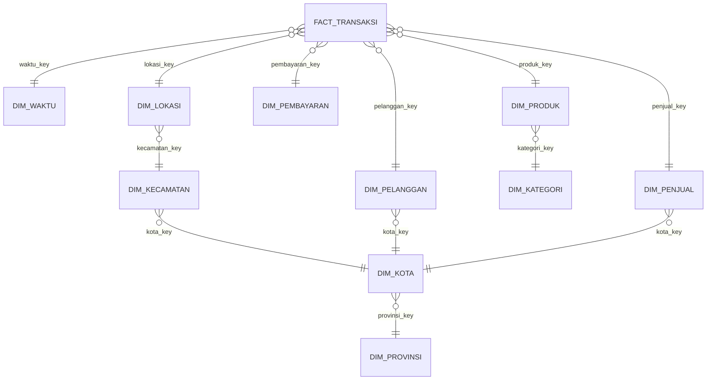

# Shopedia Commerce Warehouse Simulation

Repository ini berisi simulasi perancangan dan proses ETL **Data Warehouse** untuk **Shopedia**, sebuah perusahaan e-commerce fiktif. Dataset, nama perusahaan, pelanggan, penjual, produk, transaksi, dan seluruh nilai di dalamnya merupakan data dummy yang dibuat hanya untuk kebutuhan pembelajaran data warehouse.

Proyek ini dirancang untuk menunjukkan bagaimana data operasional e-commerce yang awalnya terpisah dalam beberapa file CSV dapat dimasukkan ke **Supabase**, dibersihkan, ditransformasikan, lalu dibentuk menjadi skema data warehouse untuk kebutuhan analisis transaksi, produk, pelanggan, penjual, pembayaran, dan wilayah.

> Catatan: Shopedia adalah nama simulasi. Dataset ini tidak menggunakan, tidak mewakili, dan tidak mengambil data dari perusahaan e-commerce nyata mana pun.

---

## 1. Gambaran Singkat Sistem

Shopedia digambarkan sebagai marketplace yang mempertemukan pelanggan dan penjual dalam proses jual beli produk secara online. Aktivitas operasional yang disimulasikan meliputi:

- pendaftaran pelanggan,
- pengelolaan toko atau merchant,
- pengelolaan katalog produk,
- pembuatan pesanan,
- detail item pesanan,
- pembayaran transaksi,
- penyimpanan alamat pelanggan,
- serta pengelompokan wilayah transaksi.

Data operasional tersebut pada awalnya masih berbentuk file CSV mentah. Oleh karena itu, file sumber tidak diberi nama seperti tabel data warehouse. Nama seperti `dim_pelanggan`, `dim_produk`, atau `fact_transaksi` hanya digunakan setelah data masuk ke layer akhir data warehouse.

---

### Struktur Organisasi Shopedia

Struktur organisasi berikut digunakan sebagai acuan pembagian bidang operasional pada dataset mentah.


Bidang seperti Customer Service, Content, Finance, Marketing / Internet Marketing, Quality Control, dan IT menjadi dasar untuk mengelompokkan sumber data operasional pada bagian dataset.

---

## 2. Lingkungan Implementasi

Proyek ini dibuat dengan menggunakan **Supabase** sebagai platform database. Supabase digunakan karena menyediakan database PostgreSQL yang dapat dipakai untuk membuat tabel, mengimpor CSV, menjalankan SQL, dan melakukan query analisis melalui SQL Editor.

Karena Supabase berjalan di atas PostgreSQL, pemisahan area kerja tidak dibuat menggunakan beberapa database terpisah. Pemisahan dilakukan menggunakan **schema PostgreSQL** seperti berikut:

| Schema | Fungsi |
|---|---|
| `raw` | Menyimpan data hasil impor CSV tanpa banyak perubahan |
| `staging` | Menyimpan data yang mulai distandarkan format dan tipe datanya |
| `warehouse` | Menyimpan tabel dimensi dan tabel fakta hasil ETL |
| `olap` | Menyimpan view, materialized view, dan data mart untuk kebutuhan analisis OLAP |

Contoh pembuatan schema di Supabase:

```sql
CREATE SCHEMA IF NOT EXISTS raw;
CREATE SCHEMA IF NOT EXISTS staging;
CREATE SCHEMA IF NOT EXISTS warehouse;
CREATE SCHEMA IF NOT EXISTS olap;
```

Dengan pendekatan ini, seluruh proses ETL tetap berada dalam satu project Supabase, tetapi setiap layer data tetap terpisah secara rapi.

---

## 3. Data Operasional Mentah

Dataset awal disusun menjadi beberapa CSV agar terlihat seperti hasil ekspor dari sistem operasional e-commerce, bukan seperti tabel data warehouse yang sudah jadi.

| No | File CSV | Bidang Operasional | Jumlah Baris | Isi Data |
|---:|---|---|---:|---|
| 1 | `customers.csv` | Customer Service | 921 | Data profil pelanggan, kontak, status, dan tanggal registrasi |
| 2 | `sellers.csv` | Marketing / Internet Marketing | 220 | Data toko, nama penjual, rating, level seller, dan status toko |
| 3 | `product_categories.csv` | Content | 35 | Referensi kategori produk |
| 4 | `products.csv` | Content / Design | 295 | Data produk, merek, kategori, harga, berat, dan status produk |
| 5 | `areas.csv` | IT | 100 | Data kecamatan, kota, provinsi, dan negara |
| 6 | `addresses.csv` | Customer Service | 858 | Data alamat yang terhubung ke pelanggan dan wilayah |
| 7 | `orders.csv` | Customer Service | 54.000 | Data header pesanan, tanggal transaksi, ongkir, dan total pembayaran |
| 8 | `order_items.csv` | Quality Control | 54.000 | Data detail produk dalam setiap pesanan |
| 9 | `payments.csv` | Finance | 54.000 | Data metode pembayaran, provider, status, dan nilai pembayaran |

---


## 4. Struktur Tabel di Supabase

### 4.1 Raw Schema

Tabel pada schema `raw` dibuat mengikuti struktur CSV apa adanya.

| Tabel Supabase | Sumber CSV |
|---|---|
| `raw.customers` | `customers.csv` |
| `raw.sellers` | `sellers.csv` |
| `raw.product_categories` | `product_categories.csv` |
| `raw.products` | `products.csv` |
| `raw.areas` | `areas.csv` |
| `raw.addresses` | `addresses.csv` |
| `raw.orders` | `orders.csv` |
| `raw.order_items` | `order_items.csv` |
| `raw.payments` | `payments.csv` |

Pada tahap ini, data masih dianggap sebagai data sumber. Kesalahan format, nilai kosong, variasi penulisan, atau nilai yang belum standar belum langsung dibuang, tetapi disiapkan untuk diproses pada tahap berikutnya.

### 4.2 Staging Schema

Schema `staging` digunakan untuk membuat versi data yang lebih bersih dan konsisten.

| Tabel | Fungsi |
|---|---|
| `staging.customers_clean` | Membersihkan data pelanggan |
| `staging.sellers_clean` | Membersihkan data penjual |
| `staging.product_categories_clean` | Membersihkan referensi kategori |
| `staging.products_clean` | Membersihkan data produk dan harga |
| `staging.areas_clean` | Menstandarkan data wilayah |
| `staging.addresses_clean` | Membersihkan alamat dan relasi wilayah |
| `staging.orders_clean` | Membersihkan data pesanan |
| `staging.order_items_clean` | Membersihkan detail item transaksi |
| `staging.payments_clean` | Membersihkan data pembayaran |

### 4.3 Warehouse Schema

Schema `warehouse` digunakan sebagai hasil akhir ETL. Pada layer ini data sudah dibentuk menjadi tabel dimensi dan fakta.

| Tabel | Jenis | Keterangan |
|---|---|---|
| `warehouse.dim_waktu` | Dimension | Dimensi waktu untuk analisis tanggal transaksi dan pembayaran |
| `warehouse.dim_pelanggan` | Dimension | Dimensi pelanggan |
| `warehouse.dim_penjual` | Dimension | Dimensi penjual atau merchant |
| `warehouse.dim_produk` | Dimension | Dimensi produk |
| `warehouse.dim_kategori` | Sub-dimension | Kategori produk |
| `warehouse.dim_pembayaran` | Dimension | Metode, jenis, provider, dan status pembayaran |
| `warehouse.dim_lokasi` | Dimension | Alamat transaksi |
| `warehouse.dim_kecamatan` | Sub-dimension | Kecamatan pelanggan, penjual, atau alamat transaksi |
| `warehouse.dim_kota` | Sub-dimension | Kota pelanggan, penjual, atau wilayah alamat |
| `warehouse.dim_provinsi` | Sub-dimension | Provinsi dan negara |
| `warehouse.fact_transaksi` | Fact | Fakta transaksi pada level item pesanan |

Grain utama dari `warehouse.fact_transaksi` adalah **satu baris untuk satu item dalam satu pesanan**. Dengan grain ini, analisis bisa dilakukan sampai level produk, kategori, penjual, pelanggan, pembayaran, dan wilayah.

### 4.4 OLAP Schema

Schema `olap` digunakan sebagai lapisan analisis di atas data warehouse. Pada schema ini, data dari `warehouse.fact_transaksi` dan tabel dimensi digabungkan menjadi view atau materialized view agar lebih mudah digunakan untuk query analisis dan visualisasi.

| Objek OLAP | Jenis | Fungsi |
|---|---|---|
| `olap.vw_transaksi_detail` | View | Menggabungkan tabel fakta dan dimensi menjadi data transaksi detail yang siap dianalisis |
| `olap.mart_sales_monthly` | Materialized View | Ringkasan penjualan berdasarkan tahun dan bulan |
| `olap.mart_product_performance` | Materialized View | Ringkasan performa produk dan kategori |
| `olap.mart_seller_performance` | Materialized View | Ringkasan performa penjual atau merchant |
| `olap.mart_payment_performance` | Materialized View | Ringkasan transaksi berdasarkan metode pembayaran |
| `olap.mart_region_performance` | Materialized View | Ringkasan transaksi berdasarkan kota dan provinsi |

Dengan adanya schema `olap`, tabel warehouse tetap digunakan sebagai sumber utama, sedangkan view OLAP digunakan sebagai data siap analisis untuk kebutuhan laporan dan dashboard.

---

## 5. Model Warehouse yang Digunakan

Model akhir menggunakan pendekatan **Snowflake Schema**. Beberapa dimensi dibuat lebih terstruktur dengan sub-dimensi, misalnya produk memiliki kategori produk, sedangkan alamat memiliki area/wilayah.




Dengan struktur tersebut, Shopedia dapat melakukan analisis seperti:

- tren penjualan per bulan,
- performa produk dan kategori,
- kontribusi penjualan dari setiap seller,
- persebaran pelanggan berdasarkan wilayah,
- total transaksi berdasarkan metode pembayaran,
- serta evaluasi nilai transaksi dan diskon.

---

## 6. Urutan Proses ETL di Supabase

Proses ETL yang disarankan:

```text
1. Upload CSV ke Supabase
2. Simpan data awal pada schema raw
3. Bersihkan dan standarkan data ke schema staging
4. Bentuk tabel dimensi pada schema warehouse
5. Bentuk tabel fakta pada schema warehouse
6. Jalankan query validasi dan query analisis
7. Bentuk view dan data mart pada schema olap
8. Gunakan hasil OLAP sebagai sumber visualisasi Power BI
```

Urutan script SQL yang dapat dibuat:

```text
01_create_schema.sql
02_create_raw_tables.sql
03_import_raw_csv.sql
04_create_staging_tables.sql
05_transform_to_staging.sql
06_create_warehouse_tables.sql
07_load_dimensions.sql
08_load_fact_transaksi.sql
09_validation_queries.sql
10_analysis_queries.sql
11_create_olap_schema.sql
12_create_olap_views.sql
13_olap_queries.sql
```

Pada Supabase, CSV dapat diimpor melalui Table Editor atau melalui SQL sesuai kebutuhan project. Setelah data masuk ke tabel `raw`, script transformasi dapat dijalankan melalui SQL Editor.

---

## 7. Aturan Transformasi Data

### 7.1 Standardisasi Teks

Beberapa nilai teks perlu diseragamkan agar hasil analisis tidak terpecah karena perbedaan penulisan.

Contoh:

| Nilai Mentah | Nilai Setelah Transformasi |
|---|---|
| `aktif`, `ACTIVE`, `Active` | `Active` |
| `nonaktif`, `Inactive`, `Blocked` | `Inactive` |
| `Sukses`, `Berhasil`, `Success` | `Success` |
| `Gagal`, `Failed` | `Failed` |

### 7.2 Konversi Tanggal

Kolom tanggal seperti `registered_at`, `joined_at`, `order_date`, dan `paid_at` dikonversi ke tipe `date` atau `timestamp` PostgreSQL.

Contoh pendekatan di Supabase/PostgreSQL:

```sql
NULLIF(order_date, '')::timestamp
```

Jika format tanggal mentah tidak seragam, proses transformasi dapat memakai validasi tambahan sebelum melakukan casting.

### 7.3 Validasi Angka dan Nominal

Kolom numerik seperti harga, diskon, ongkir, dan total transaksi perlu dikonversi menjadi tipe `numeric`.

Kolom yang perlu divalidasi antara lain:

```text
base_price
unit_price
discount_amount
line_total
items_total
shipping_fee
grand_total
payment_amount
```

Nilai negatif pada harga, kuantitas, atau total transaksi tidak boleh langsung dimasukkan ke tabel fakta tanpa koreksi atau pengecualian pada tahap transformasi.

### 7.4 Perhitungan Ulang Total Transaksi

Total transaksi sebaiknya dihitung ulang dari data detail agar tidak bergantung sepenuhnya pada nilai raw.

Rumus yang digunakan:

```text
line_total = (quantity * unit_price) - discount_amount
grand_total = SUM(line_total per order) + shipping_fee
```

Hasil perhitungan ini digunakan untuk memastikan nilai pada `orders.csv`, `order_items.csv`, dan `payments.csv` tetap konsisten.

### 7.5 Penanganan Missing Value

| Kondisi | Penanganan |
|---|---|
| Email atau nomor telepon kosong | Diisi `Unknown` jika dibutuhkan untuk laporan |
| Provider pembayaran tidak relevan | Diisi `Not Applicable` |
| Tanggal pembayaran belum ada | Dibiarkan `NULL` jika transaksi belum dibayar |
| Relasi dimensi tidak ditemukan | Dipetakan ke row `Unknown` pada dimensi terkait |
| Nilai numerik tidak valid | Dikoreksi atau tidak dimuat ke tabel fakta |

---

## 8. Contoh Query Validasi

### 8.1 Mengecek Jumlah Data Fakta

```sql
SELECT COUNT(*) AS total_fact_rows
FROM warehouse.fact_transaksi;
```

### 8.2 Mengecek Nilai Penjualan

```sql
SELECT
    SUM(jumlah_produk) AS total_quantity,
    SUM(total_harga) AS total_sales,
    SUM(diskon) AS total_discount
FROM warehouse.fact_transaksi;
```

### 8.3 Mengecek Foreign Key Kosong

```sql
SELECT
    SUM(CASE WHEN waktu_key IS NULL THEN 1 ELSE 0 END) AS null_waktu_key,
    SUM(CASE WHEN pelanggan_key IS NULL THEN 1 ELSE 0 END) AS null_pelanggan_key,
    SUM(CASE WHEN penjual_key IS NULL THEN 1 ELSE 0 END) AS null_penjual_key,
    SUM(CASE WHEN produk_key IS NULL THEN 1 ELSE 0 END) AS null_produk_key,
    SUM(CASE WHEN pembayaran_key IS NULL THEN 1 ELSE 0 END) AS null_pembayaran_key,
    SUM(CASE WHEN lokasi_key IS NULL THEN 1 ELSE 0 END) AS null_lokasi_key
FROM warehouse.fact_transaksi;
```

### 8.4 Mengecek Nominal Tidak Valid

```sql
SELECT
    SUM(CASE WHEN jumlah_produk <= 0 THEN 1 ELSE 0 END) AS invalid_quantity,
    SUM(CASE WHEN harga_satuan < 0 THEN 1 ELSE 0 END) AS negative_unit_price,
    SUM(CASE WHEN total_harga < 0 THEN 1 ELSE 0 END) AS negative_line_total
FROM warehouse.fact_transaksi;
```

---

## 9. Contoh Query Analisis

### 9.1 Penjualan Berdasarkan Kategori Produk

```sql
SELECT
    k.nama_kategori,
    COUNT(*) AS total_transaction_items,
    SUM(f.jumlah_produk) AS total_quantity,
    SUM(f.total_harga) AS total_sales
FROM warehouse.fact_transaksi f
LEFT JOIN warehouse.dim_produk p
    ON f.produk_key = p.produk_key
LEFT JOIN warehouse.dim_kategori k
    ON p.kategori_key = k.kategori_key
GROUP BY k.nama_kategori
ORDER BY total_sales DESC;
```

### 9.2 Tren Penjualan Bulanan

```sql
SELECT
    w.tahun,
    w.bulan,
    COUNT(*) AS total_transaction_items,
    SUM(f.total_harga) AS total_sales
FROM warehouse.fact_transaksi f
LEFT JOIN warehouse.dim_waktu w
    ON f.waktu_key = w.waktu_key
GROUP BY w.tahun, w.bulan
ORDER BY w.tahun, w.bulan;
```

### 9.3 Performa Metode Pembayaran

```sql
SELECT
    p.metode_pembayaran,
    p.provider,
    COUNT(*) AS total_payments,
    SUM(f.total_harga) AS total_sales
FROM warehouse.fact_transaksi f
LEFT JOIN warehouse.dim_pembayaran p
    ON f.pembayaran_key = p.pembayaran_key
GROUP BY p.metode_pembayaran, p.provider
ORDER BY total_sales DESC;
```

### 9.4 Performa Seller

```sql
SELECT
    s.nama_toko,
    COUNT(*) AS total_transaction_items,
    SUM(f.jumlah_produk) AS total_quantity,
    SUM(f.total_harga) AS total_sales
FROM warehouse.fact_transaksi f
LEFT JOIN warehouse.dim_penjual s
    ON f.penjual_key = s.penjual_key
GROUP BY s.nama_toko
ORDER BY total_sales DESC;
```

---

## 10. Tahap OLAP di Supabase

Setelah proses ETL selesai dan tabel pada schema `warehouse` sudah terbentuk, tahap berikutnya adalah **OLAP (Online Analytical Processing)**. Tahap OLAP digunakan untuk menganalisis data warehouse dari berbagai sudut pandang bisnis, seperti waktu, produk, kategori, seller, pelanggan, wilayah, dan metode pembayaran.

Pada project Shopedia, OLAP tidak dibuat menggunakan cube server terpisah, tetapi menggunakan fitur PostgreSQL di Supabase berupa **view** dan **materialized view**. Pendekatan ini dipilih karena Supabase berjalan di atas PostgreSQL, sehingga proses analisis dapat tetap dilakukan langsung melalui SQL Editor.

Alur OLAP yang digunakan:

```text
warehouse.fact_transaksi + tabel dimensi
        ↓
olap.vw_transaksi_detail
        ↓
olap data mart / materialized view
        ↓
query OLAP dan dashboard Power BI
```

### 10.1 Tujuan OLAP

Tujuan dari tahap OLAP adalah:

- menyederhanakan query analisis yang sebelumnya membutuhkan banyak join;
- menyediakan data ringkasan untuk laporan bisnis;
- mendukung analisis roll-up, drill-down, slice, dice, dan pivot;
- menyediakan data siap pakai untuk dashboard Power BI;
- membantu melihat performa transaksi, produk, seller, pembayaran, dan wilayah.

### 10.2 Measure dan Dimension

Dalam OLAP, data dianalisis menggunakan **measure** dan **dimension**.

| Jenis | Contoh pada Shopedia | Keterangan |
|---|---|---|
| Measure | `total_sales`, `total_quantity`, `total_discount`, `total_orders`, `average_order_value` | Nilai numerik yang dihitung |
| Dimension | waktu, produk, kategori, seller, pelanggan, pembayaran, kota, provinsi | Sudut pandang analisis |

Contoh kombinasi analisis:

| Analisis | Dimension | Measure |
|---|---|---|
| Tren penjualan | Tahun, bulan | Total order, total quantity, total sales |
| Performa produk | Produk, kategori | Quantity dan revenue |
| Performa seller | Seller, kota seller | Total transaksi dan total sales |
| Metode pembayaran | Metode, provider | Total pembayaran dan total sales |
| Wilayah transaksi | Kota, provinsi | Total order dan total sales |

### 10.3 View Transaksi Detail

View transaksi detail dibuat untuk menggabungkan tabel fakta dan tabel dimensi menjadi satu objek analisis yang lebih mudah digunakan.

Contoh pembuatan view:

```sql
CREATE OR REPLACE VIEW olap.vw_transaksi_detail AS
SELECT
    f.transaksi_key,
    f.jumlah_produk,
    f.harga_satuan,
    f.diskon,
    f.total_harga,

    w.tanggal,
    w.hari,
    w.bulan,
    w.tahun,
    w.minggu_ke,
    w.kuartal,

    p.nama_produk,
    p.brand,
    k.nama_kategori,

    pl.nama_pelanggan,
    pl.email AS email_pelanggan,

    s.nama_toko,
    s.nama_penjual,

    pb.metode_pembayaran,
    pb.jenis_pembayaran,
    pb.provider,
    pb.status_pembayaran,

    l.alamat,
    kc.nama_kecamatan,
    kt.nama_kota,
    pr.nama_provinsi
FROM warehouse.fact_transaksi f
LEFT JOIN warehouse.dim_waktu w
    ON f.waktu_key = w.waktu_key
LEFT JOIN warehouse.dim_produk p
    ON f.produk_key = p.produk_key
LEFT JOIN warehouse.dim_kategori k
    ON p.kategori_key = k.kategori_key
LEFT JOIN warehouse.dim_pelanggan pl
    ON f.pelanggan_key = pl.pelanggan_key
LEFT JOIN warehouse.dim_penjual s
    ON f.penjual_key = s.penjual_key
LEFT JOIN warehouse.dim_pembayaran pb
    ON f.pembayaran_key = pb.pembayaran_key
LEFT JOIN warehouse.dim_lokasi l
    ON f.lokasi_key = l.lokasi_key
LEFT JOIN warehouse.dim_kecamatan kc
    ON l.kecamatan_key = kc.kecamatan_key
LEFT JOIN warehouse.dim_kota kt
    ON kc.kota_key = kt.kota_key
LEFT JOIN warehouse.dim_provinsi pr
    ON kt.provinsi_key = pr.provinsi_key;
```

Dengan view ini, query analisis tidak perlu lagi melakukan join berulang dari banyak tabel dimensi.

### 10.4 Data Mart OLAP

Data mart OLAP dibuat dalam bentuk materialized view agar hasil agregasi dapat digunakan lebih cepat untuk dashboard.

#### 10.4.1 Monthly Sales Mart

```sql
CREATE MATERIALIZED VIEW olap.mart_sales_monthly AS
SELECT
    tahun,
    bulan,
    COUNT(*) AS total_transaction_items,
    SUM(jumlah_produk) AS total_quantity,
    SUM(total_harga) AS total_sales,
    AVG(total_harga) AS average_transaction_value
FROM olap.vw_transaksi_detail
GROUP BY tahun, bulan;
```

#### 10.4.2 Product Performance Mart

```sql
CREATE MATERIALIZED VIEW olap.mart_product_performance AS
SELECT
    nama_kategori,
    nama_produk,
    brand,
    COUNT(*) AS total_transaction_items,
    SUM(jumlah_produk) AS total_quantity,
    SUM(total_harga) AS total_sales,
    SUM(diskon) AS total_discount
FROM olap.vw_transaksi_detail
GROUP BY nama_kategori, nama_produk, brand;
```

#### 10.4.3 Seller Performance Mart

```sql
CREATE MATERIALIZED VIEW olap.mart_seller_performance AS
SELECT
    nama_toko,
    nama_penjual,
    COUNT(*) AS total_transaction_items,
    SUM(jumlah_produk) AS total_quantity,
    SUM(total_harga) AS total_sales
FROM olap.vw_transaksi_detail
GROUP BY nama_toko, nama_penjual;
```

#### 10.4.4 Payment Performance Mart

```sql
CREATE MATERIALIZED VIEW olap.mart_payment_performance AS
SELECT
    metode_pembayaran,
    jenis_pembayaran,
    provider,
    status_pembayaran,
    COUNT(*) AS total_transaction_items,
    SUM(total_harga) AS total_sales
FROM olap.vw_transaksi_detail
GROUP BY metode_pembayaran, jenis_pembayaran, provider, status_pembayaran;
```

#### 10.4.5 Region Performance Mart

```sql
CREATE MATERIALIZED VIEW olap.mart_region_performance AS
SELECT
    nama_provinsi,
    nama_kota,
    COUNT(*) AS total_transaction_items,
    SUM(jumlah_produk) AS total_quantity,
    SUM(total_harga) AS total_sales
FROM olap.vw_transaksi_detail
GROUP BY nama_provinsi, nama_kota;
```

Jika data pada warehouse berubah, materialized view perlu diperbarui menggunakan perintah berikut:

```sql
REFRESH MATERIALIZED VIEW olap.mart_sales_monthly;
REFRESH MATERIALIZED VIEW olap.mart_product_performance;
REFRESH MATERIALIZED VIEW olap.mart_seller_performance;
REFRESH MATERIALIZED VIEW olap.mart_payment_performance;
REFRESH MATERIALIZED VIEW olap.mart_region_performance;
```

### 10.5 Operasi OLAP

Operasi OLAP digunakan untuk melihat data dari beberapa tingkat detail dan sudut pandang.

#### Roll-up

Roll-up adalah proses menaikkan level detail data, misalnya dari penjualan bulanan menjadi penjualan tahunan.

```sql
SELECT
    tahun,
    SUM(total_sales) AS total_sales
FROM olap.mart_sales_monthly
GROUP BY tahun
ORDER BY tahun;
```

#### Drill-down

Drill-down adalah proses menurunkan level detail data, misalnya dari provinsi ke kota.

```sql
SELECT
    nama_provinsi,
    nama_kota,
    SUM(total_sales) AS total_sales
FROM olap.mart_region_performance
GROUP BY nama_provinsi, nama_kota
ORDER BY nama_provinsi, total_sales DESC;
```

#### Slice

Slice adalah proses mengambil satu bagian data berdasarkan satu kondisi tertentu, misalnya hanya kategori produk tertentu.

```sql
SELECT
    nama_produk,
    SUM(total_sales) AS total_sales
FROM olap.mart_product_performance
WHERE nama_kategori = 'Elektronik'
GROUP BY nama_produk
ORDER BY total_sales DESC;
```

#### Dice

Dice adalah proses mengambil data berdasarkan beberapa kondisi sekaligus, misalnya kategori tertentu, tahun tertentu, dan metode pembayaran tertentu.

```sql
SELECT
    tahun,
    bulan,
    nama_kategori,
    metode_pembayaran,
    SUM(total_harga) AS total_sales
FROM olap.vw_transaksi_detail
WHERE tahun = 2025
  AND nama_kategori IN ('Elektronik', 'Fashion')
  AND metode_pembayaran = 'E-Wallet'
GROUP BY tahun, bulan, nama_kategori, metode_pembayaran
ORDER BY tahun, bulan;
```

#### Pivot

Pivot digunakan untuk mengubah sudut pandang data, misalnya menjadikan metode pembayaran sebagai kolom.

```sql
SELECT
    tahun,
    bulan,
    SUM(CASE WHEN metode_pembayaran = 'E-Wallet' THEN total_harga ELSE 0 END) AS e_wallet_sales,
    SUM(CASE WHEN metode_pembayaran = 'Bank Transfer' THEN total_harga ELSE 0 END) AS bank_transfer_sales,
    SUM(CASE WHEN metode_pembayaran = 'COD' THEN total_harga ELSE 0 END) AS cod_sales,
    SUM(CASE WHEN metode_pembayaran = 'Credit Card' THEN total_harga ELSE 0 END) AS credit_card_sales
FROM olap.vw_transaksi_detail
GROUP BY tahun, bulan
ORDER BY tahun, bulan;
```

### 10.6 Contoh Query OLAP Tambahan

#### Top 10 Produk Berdasarkan Revenue

```sql
SELECT
    nama_produk,
    nama_kategori,
    SUM(total_sales) AS total_sales,
    SUM(total_quantity) AS total_quantity
FROM olap.mart_product_performance
GROUP BY nama_produk, nama_kategori
ORDER BY total_sales DESC
LIMIT 10;
```

#### Top 10 Seller Berdasarkan Revenue

```sql
SELECT
    nama_toko,
    SUM(total_sales) AS total_sales,
    SUM(total_quantity) AS total_quantity
FROM olap.mart_seller_performance
GROUP BY nama_toko
ORDER BY total_sales DESC
LIMIT 10;
```

#### Kontribusi Penjualan per Provinsi

```sql
SELECT
    nama_provinsi,
    SUM(total_sales) AS total_sales,
    ROUND(
        SUM(total_sales) * 100.0 / SUM(SUM(total_sales)) OVER (),
        2
    ) AS sales_percentage
FROM olap.mart_region_performance
GROUP BY nama_provinsi
ORDER BY total_sales DESC;
```

---

## 11. Visualisasi OLAP dengan Power BI

Visualisasi OLAP pada project ini dibuat menggunakan **Power BI Desktop**. Power BI digunakan sebagai tool Business Intelligence untuk menampilkan hasil analisis dari data warehouse dan OLAP view yang sudah dibuat di Supabase.

Alur visualisasi yang digunakan:

```text
Supabase PostgreSQL
        ↓
warehouse schema / olap schema
        ↓
export query result atau koneksi PostgreSQL
        ↓
Power BI Desktop
        ↓
dashboard visualisasi Shopedia
```

### 11.1 Sumber Data Visualisasi

Sumber data utama untuk visualisasi berasal dari schema `olap`, terutama:

| Sumber Data | Digunakan Untuk |
|---|---|
| `olap.vw_transaksi_detail` | Analisis detail transaksi dan eksplorasi data |
| `olap.mart_sales_monthly` | Grafik tren penjualan bulanan |
| `olap.mart_product_performance` | Grafik kategori produk dan top produk |
| `olap.mart_seller_performance` | Grafik performa seller |
| `olap.mart_payment_performance` | Grafik metode pembayaran |
| `olap.mart_region_performance` | Grafik wilayah transaksi |

### 11.2 Cara Menghubungkan Supabase ke Power BI

Terdapat dua cara yang dapat digunakan.

#### Opsi 1: Export CSV dari Supabase

Cara ini paling sederhana untuk kebutuhan tugas.

```text
1. Jalankan query OLAP di Supabase SQL Editor.
2. Export hasil query menjadi CSV.
3. Import CSV ke Power BI Desktop.
4. Buat dashboard dari data hasil export.
```

#### Opsi 2: Koneksi Langsung PostgreSQL

Power BI juga dapat dihubungkan langsung ke database PostgreSQL Supabase.

```text
1. Buka Power BI Desktop.
2. Pilih Get Data.
3. Pilih PostgreSQL database.
4. Masukkan host, database, username, dan password dari Supabase.
5. Pilih tabel atau view dari schema olap.
6. Load data ke Power BI.
```

Untuk project ini, opsi export CSV dapat digunakan jika ingin proses yang lebih sederhana dan stabil. Opsi koneksi langsung dapat digunakan jika ingin dashboard lebih mudah diperbarui.

### 11.3 Komponen Dashboard

Dashboard Shopedia disusun untuk menampilkan ringkasan performa e-commerce dari beberapa sudut pandang.

| Komponen | Jenis Visual | Sumber Data | Tujuan |
|---|---|---|---|
| Total Revenue | Card | `olap.vw_transaksi_detail` | Menampilkan total nilai penjualan |
| Total Orders | Card | `olap.vw_transaksi_detail` | Menampilkan jumlah transaksi/item transaksi |
| Total Customers | Card | `warehouse.dim_pelanggan` | Menampilkan jumlah pelanggan |
| Average Order Value | Card | `olap.vw_transaksi_detail` | Menampilkan rata-rata nilai transaksi |
| Tren Penjualan Bulanan | Line Chart | `olap.mart_sales_monthly` | Melihat perubahan penjualan dari waktu ke waktu |
| Penjualan per Kategori | Bar Chart | `olap.mart_product_performance` | Melihat kategori dengan kontribusi penjualan terbesar |
| Top 10 Produk Terlaris | Horizontal Bar Chart | `olap.mart_product_performance` | Melihat produk dengan penjualan tertinggi |
| Top 10 Seller | Horizontal Bar Chart | `olap.mart_seller_performance` | Melihat seller dengan revenue terbesar |
| Distribusi Metode Pembayaran | Donut Chart | `olap.mart_payment_performance` | Melihat metode pembayaran yang paling sering digunakan |
| Penjualan per Provinsi | Bar Chart / Map | `olap.mart_region_performance` | Melihat persebaran penjualan berdasarkan wilayah |

### 11.4 Rancangan Layout Dashboard

Rancangan layout dashboard yang disarankan:

```text
+-------------------------------------------------------------+
| Total Revenue | Total Orders | Total Customers | Avg Order  |
+-------------------------------------------------------------+
|               Tren Penjualan Bulanan                       |
+-----------------------------+-------------------------------+
| Penjualan per Kategori      | Distribusi Metode Pembayaran   |
+-----------------------------+-------------------------------+
| Top 10 Produk Terlaris      | Top 10 Seller                  |
+-----------------------------+-------------------------------+
| Penjualan per Provinsi / Kota                               |
+-------------------------------------------------------------+
```

Dashboard dapat disimpan dalam file Power BI dengan nama:

```text
PowerBI/Shopedia_OLAP_Dashboard.pbix
```

Screenshot dashboard dapat disimpan pada folder:

```text
Image/DashboardOLAP.png
```

Lalu ditampilkan di README dengan format berikut:

```markdown

```

### 11.5 Manfaat Dashboard

Dashboard Power BI membantu proses analisis karena hasil OLAP tidak hanya ditampilkan dalam bentuk tabel query, tetapi juga dalam bentuk visual yang lebih mudah dibaca. Dengan dashboard ini, pengguna dapat melihat tren penjualan, performa kategori produk, produk terlaris, seller terbaik, metode pembayaran yang dominan, dan wilayah dengan kontribusi transaksi terbesar.

---

## 12. Struktur Folder Project

Struktur folder yang disarankan:

```text
Shopedia/
|-- Data/
|   |-- customers.csv
|   |-- sellers.csv
|   |-- product_categories.csv
|   |-- products.csv
|   |-- areas.csv
|   |-- addresses.csv
|   |-- orders.csv
|   |-- order_items.csv
|   `-- payments.csv
|-- Image/
|   |-- StrukturOrganisasi.png
|   |-- TabelERD.png
|   `-- VisualisasiHasilQueryOLAP.png
|-- Visualisasi/
|   `-- Shopedia.pbix
|-- sql/
|   |-- 01_create_schema.sql
|   |-- 02_create_raw_tables.sql
|   |-- 03_import_raw_csv.sql
|   |-- 04_create_staging_tables.sql
|   |-- 05_transform_to_staging.sql
|   |-- 06_create_warehouse_tables.sql
|   |-- 07_load_dimensions.sql
|   |-- 08_load_fact_transaksi.sql
|   |-- 09_validation_queries.sql
|   |-- 10_analysis_queries.sql
|   |-- 11_create_olap_schema.sql
|   |-- 12_create_olap_views.sql
|   `-- 13_olap_queries.sql
`-- README.md
```

---

## 13. Catatan Penggunaan di Supabase dan Power BI

Langkah umum penggunaan:

1. Buat project baru di Supabase.
2. Jalankan script `01_create_schema.sql` untuk membuat schema `raw`, `staging`, `warehouse`, dan `olap`.
3. Buat tabel raw sesuai struktur CSV.
4. Impor masing-masing CSV ke tabel pada schema `raw`.
5. Jalankan script transformasi untuk mengisi schema `staging`.
6. Jalankan script pembuatan tabel warehouse.
7. Load data dimensi terlebih dahulu.
8. Load `warehouse.fact_transaksi` setelah seluruh dimensi tersedia.
9. Jalankan query validasi.
10. Jalankan query analisis dasar.
11. Buat view dan materialized view pada schema `olap`.
12. Jalankan query OLAP seperti roll-up, drill-down, slice, dice, dan pivot.
13. Export hasil OLAP atau hubungkan Power BI langsung ke Supabase PostgreSQL.
14. Buat dashboard visualisasi di Power BI Desktop.
15. Simpan screenshot dashboard ke folder `Image` dan file `.pbix` ke folder `PowerBI`.

Hal penting yang perlu diperhatikan:

- Supabase menggunakan PostgreSQL, sehingga sintaks SQL disesuaikan dengan PostgreSQL.
- Tidak perlu membuat database baru seperti `Shopedia_Staging` dan `Shopedia_DW`; cukup gunakan schema.
- Nama tabel raw tetap dibuat menyerupai nama file operasional.
- Nama tabel dimensi dan fakta hanya digunakan pada schema `warehouse`.
- View dan materialized view OLAP disimpan pada schema `olap`.
- Visualisasi dibuat menggunakan Power BI Desktop.
- Semua data dalam project ini adalah data dummy.

---

## 14. Ringkasan Akhir

Project ini mensimulasikan proses pembangunan data warehouse e-commerce untuk Shopedia menggunakan Supabase. Data awal disusun sebagai CSV operasional mentah, kemudian diproses melalui layer `raw`, `staging`, dan `warehouse`.

Setelah warehouse terbentuk, data diproses lebih lanjut pada schema `olap` dalam bentuk view dan materialized view. Tahap OLAP digunakan untuk mendukung analisis roll-up, drill-down, slice, dice, pivot, serta pembuatan dashboard visualisasi.

Hasil akhir dari project ini adalah Snowflake Schema yang dapat digunakan untuk analisis transaksi, performa produk, performa seller, perilaku pelanggan, metode pembayaran, persebaran wilayah penjualan, dan visualisasi dashboard menggunakan Power BI Desktop.
